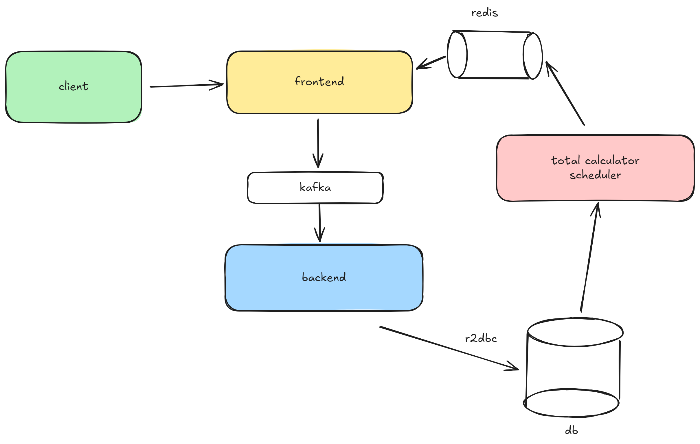
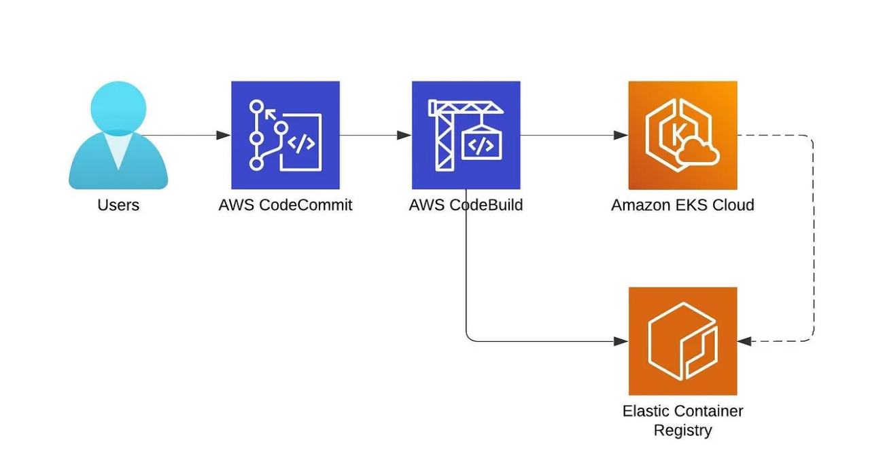

# System Architecture Diagram



# API Documentation

## Swagger UI

This project includes Swagger UI for easy visualization and exploration of the API. Swagger UI allows you to interact with the API documentation in a user-friendly way.

To access Swagger UI, open your web browser and navigate to the following path:
[/webjars/swagger-ui/index.html](/webjars/swagger-ui/index.html)


This will launch Swagger UI, where you can explore the available API endpoints, view request and response examples, and test API calls directly from the documentation.

## OpenAPI Specification

The OpenAPI Specification (OAS) is provided to offer a comprehensive view of the API's structure and functionality. The raw OpenAPI JSON can be accessed at:
[/v3/api-docs](/v3/api-docs)

You can use this OpenAPI Specification to generate client libraries, server stubs, and more. This can be particularly useful for automating the integration process.

# Why buildSrc

I use `buildSrc` for sharing build logic across subprojects. All dependencies for all modules are in `root-dependencies.build` file. More details:

- [Sharing Build Logic](https://docs.gradle.org/current/userguide/sharing_build_logic_between_subprojects.html)
- [Multi-Project Builds](https://docs.gradle.org/current/userguide/multi_project_builds.html)
- [Java Multi-Project Sample](https://docs.gradle.org/current/samples/sample_building_java_applications_multi_project.html#review_the_project_files)

# How to Start the Application Locally

## Prerequisites

1. Install [Docker Desktop](https://www.docker.com/products/docker-desktop)
2. Run the following command to see which port is exposed for minikube
    ```
     docker-compose -f .\config-files\docker-compose-for-local-development\docker-compose.yml up -d
    ```
3. gradlew clean build
4. Start applications with 'local' profile

# How to Deploy application to AWS

## Prerequisites
1. Install aws cli, kubectl, eksctl, helm 

### Create policy for aws load balancer controller for ingress
2. curl -o iam-policy.json https://raw.githubusercontent.com/kubernetes-sigs/aws-load-balancer-controller/v2.4.7/docs/install/iam_policy.json
3. aws iam create-policy \
   --policy-name AWSLoadBalancerControllerIAMPolicy \
   --policy-document iam-policy.json
### Update config-cluster.yaml file and create cluster. 
4. eksctl create cluster -f \kubernetes\config-cluster.yaml
[config-cluster.yaml](deployment-scripts%2Fconfig-cluster.yaml)
### Install aws load balancer controller
4. helm repo add eks https://aws.github.io/eks-charts
5. helm repo update eks
6. kubectl apply -k "github.com/aws/eks-charts/stable/aws-load-balancer-controller//crds?ref=master"
7. helm install aws-load-balancer-controller eks/aws-load-balancer-controller \
   -n kube-system \
   --set clusterName=promotion-cluster \
   --set serviceAccount.create=false \
   --set serviceAccount.name=aws-load-balancer-controller
### Install storage class driver for ebs
8. eksctl utils associate-iam-oidc-provider --region=us-east-1 --cluster=promotion-cluster --approve
9. eksctl create iamserviceaccount --region us-east-1 --name ebs-csi-controller-sa --namespace kube-system --cluster promotion-cluster --attach-policy-arn arn:aws:iam::aws:policy/service-role/AmazonEBSCSIDriverPolicy  --approve --role-only --role-name AmazonEKS_EBS_CSI_DriverRole
10. eksctl create addon --name aws-ebs-csi-driver --cluster promotion-cluster --service-account-role-arn arn:aws:iam::$(aws sts get-caller-identity --query Account --output text):role/AmazonEKS_EBS_CSI_DriverRole --force
### Install kafka 
11. kubectl create namespace kafka
12. kubectl create -f 'https://strimzi.io/install/latest?namespace=kafka' -n kafka
13. kubectl apply -f .\kafka.yaml -n kafka
    [kafka.yaml](deployment-scripts%2Fkafka.yaml)
### Create managed DB
14. Create security group in eks cluster vpc. Group should allow postgress 5432 inbound from cluster security group. This would mean that db would only accept connections from within eks cluster and it wouldn't be publicly accessible.
15. Create db in aws management console (UI) only after you create eks cluster.
16. Choose vpc of eks cluster so db and eks would be in the same vpc 
17. Choose security group that you created earlier when creating managed db. 
18. Here is [psql-client.yaml](deployment-scripts%2Fpsql-client.yaml) file. Create pod to connect to db to create database. 
19. kubectl apply -f .\psql-client.yaml
20. kubectl exec -it psql-client -- /bin/sh
21. psql -h database-1.crc2seeos3gf.us-east-1.rds.amazonaws.com -U postgres
22.  CREATE DATABASE bohdansavshak_nytaxi;
23. kubectl create secret generic bohdansavshak-secret --from-literal=DB_USERNAME=<db_username> --from-literal=DB_PASSWORD=<db_password> -n bohdansavshak
### Create Redis 
24. kubectl create namespace bohdansavshak
25. kubectl config set-context --current --namespace=bohdansavshak 
26. kubectl apply -f .\redis-statefulset.yaml 
[redis-statefulset.yml](deployment-scripts%2Fredis-statefulset.yml)


# CI/CD configuration

### Create ECR and CodeBuildEKSRole
1. aws ecr create-repository --repository-name promotion --image-tag-mutability IMMUTABLE --image-scanning-configuration scanOnPush=true
2. aws sts get-caller-identity --query Account --output text
3. export ACCOUNT_ID=<aws account id>
4. TRUST="{ \"Version\": \"2012-10-17\", \"Statement\": [ { \"Effect\": \"Allow\", \"Principal\": { \"AWS\": \"arn:aws:iam::${ACCOUNT_ID}:root\" }, \"Action\": \"sts:AssumeRole\" } ] }"
5. aws iam create-role --role-name CodeBuildEKSRole --assume-role-policy-document "$TRUST" --output text --query 'Role.Arn'
6. echo '{ "Version": "2012-10-17", "Statement": [ { "Effect": "Allow", "Action": "eks:Describe*", "Resource": "*" } ] }' > eksdescribe.json
7. aws iam put-role-policy --role-name CodeBuildEKSRole --policy-name eks-describe-policy --policy-document file://eksdescribe.json
### Patch the aws-auth configmap with new role
8. kubectl get configmap aws-auth -o yaml -n kube-system
9. export ACCOUNT_ID=<aws account id>
10. ROLE=" - rolearn: arn:aws:iam::$ACCOUNT_ID:role/CodeBuildEKSRole\n username: build\n groups:\n - system:masters
11. kubectl get -n kube-system configmap/aws-auth -o yaml | awk "/mapRoles: \|/{print;print \"$ROLE\";next}1" > /tmp/auth-patch.yml
12. kubectl patch configmap/aws-auth -n kube-system --patch "$(cat auth-patch.yml)"
13. In order for this buildspec to work you need to add some environment variable
### Manual creation of CodePipeline
14. Create CodePipeline
15. Select CodeCommit as Source provider
16. Under the build stage, choose AWS CodeBuild as the build provider, and under the Project name, click on Create project.
    Before moving to the next step, you need to create next environment variables
    EKS_CLUSTERNAME=<your eks cluster name>
    EKS_ROLE_ARN=<ARN of CodeBuildEKSRole>
    REPOSITORY_URL=<ECR repository>
17. Under the deploy stage, click on Skip deploy stage. As deploy doesn’t support EKS.
18. Go to the IAM console, Policies, and click on Create policy.

{
"Version": "2012-10-17",
"Statement": [
{
"Sid": "VisualEditor0",
"Effect": "Allow",
"Action": "sts:AssumeRole",
"Resource": "arn:aws:iam::XXXXXXX:role/CodeBuildEKSRole"
}
]
}

19. Go back to the IAM role "codebuild-promotion-service-role", click on attach and attach the policy that you just created.
20. Also, this role doesn’t have permission to push newly created docker images to the EC2 repo, so attach one more policy. AmazonEC2ContainerRegistryFullAccess
21. Go to CodeBuild and click edit go to artifacts then select s3 and type /cache/archive for the path. This will save dependencies in s3 for your ci/cd it will reduce build time. 

# S3 for sample data. 
1. kubectl apply -f .\aws-cli.yaml
2. kubectl exec -it aws-cli -- aws sts get-caller-identity
3. Attach this policy AmazonS3ReadOnlyAccess to role that you just checked.
4. aws s3api create-bucket --bucket 467576817753-bohdansavshak-nytaxi --region us-east-1
5. Prepare files in my case I prepared two files. first_half_of_the_2018_the_smallest_set.csv and second_half_of_the_2018_the_smallest_set.csv
6. upload files to s3 by using command aws s3 cp /path/to/myfolder s3://467576817753-bohdansavshak-nytaxi --recursive

### DNS and HTTPS. Create certificate in ACM
1. aws acm request-certificate --domain-name promotion.bohdansavshak.com --validation-method DNS
2. aws acm describe-certificate --certificate-arn arn:aws:acm:us-east-1:467576817753:certificate/962f9f71-b56f-4d91-8f5d-6e1fd66fa9a1
3. to get cname record details that you need to create in DNS.
4. Update DNS records to validate certificate.
5. Find the load balancer dns and create record for it in DNS.
### To delete eks cluser with all resources.
6. eksctl delete cluster promotion-cluster